# Tech Primer Template

Description/Purpose:
- For generally creating a Tech Primer a template can be used. This repository is the template from which to process.

## Prerequisites
- Git
- Terminal
- IDE

## Assumptions
- Know how to navigate Github web UI
- How to take local Screenshots of desktop

## Instructions

### Creating New Repo

Obtain login credentials for Git. SSH into DevCPortal server. To obtain password, contact
IT Team under Bruce.
```shell
ssh -i devcportal@10.0.6.38
```
- 

Open the encrypted file with password obtained from IT Team and get password.
- 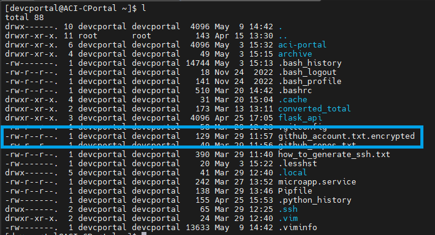
- Password is under name: "nonprod passwd"

Navigate to Github account and login.
- 

Create a new Repository.
- 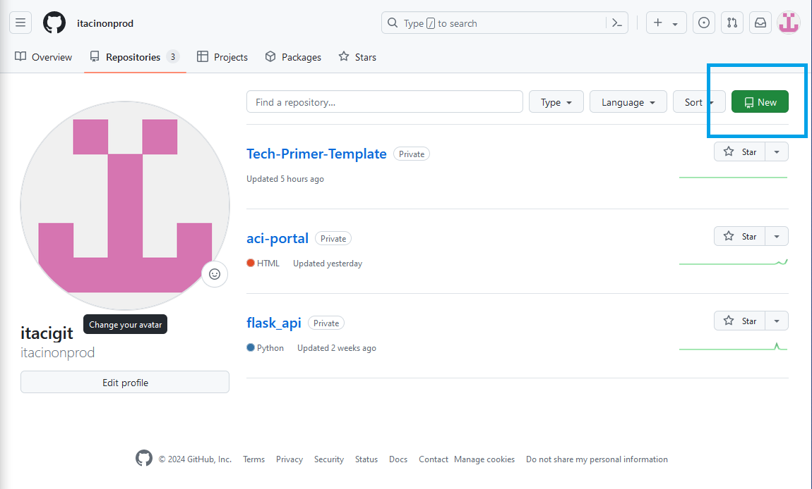

[//]: # (Once Organization is enabled in Git, add step: Create a new repository from the tech primer template.)

Enter both a description and title.
- 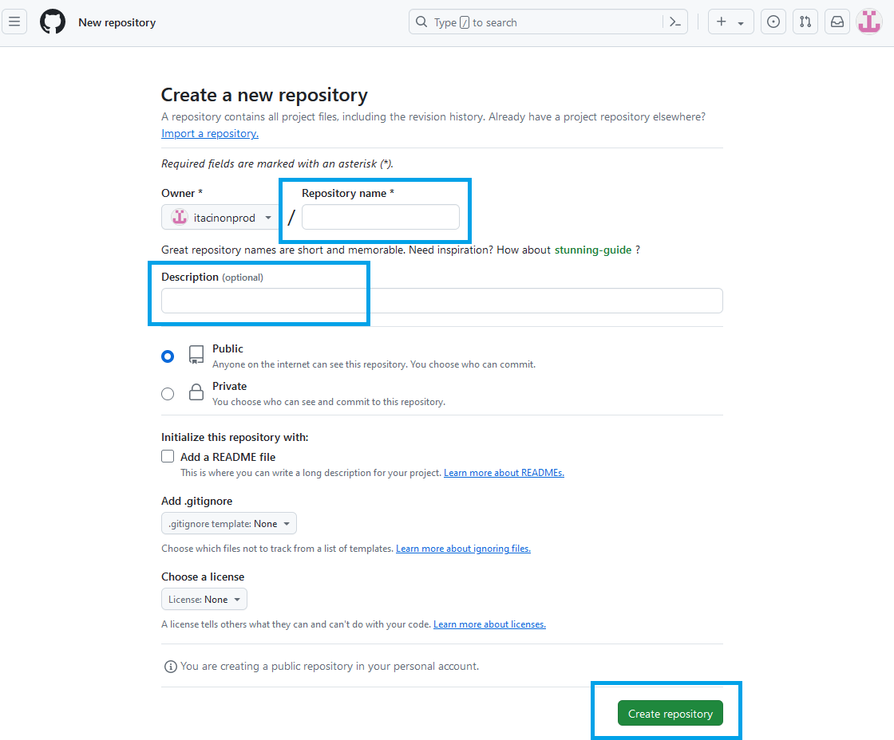

Open Repo settings with gear icon on right, and add Github topics as part of the creation:
- tech-primer
- techprimer
- 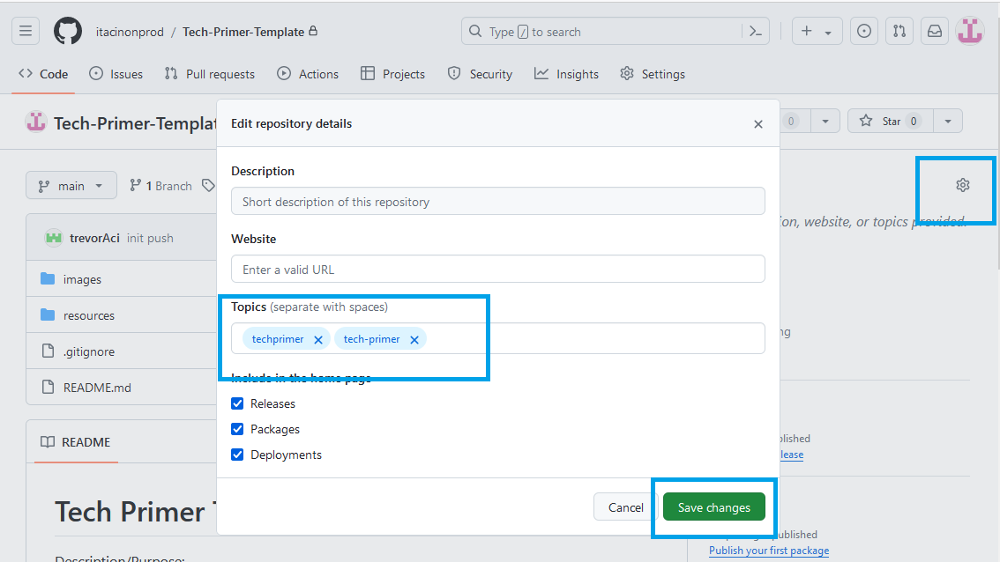

You are more than welcome to add a .gitignore file as part of this. If you would like, there is a .gitignore template
with most commonly ignored folders and directories in this repo's root directory.
- 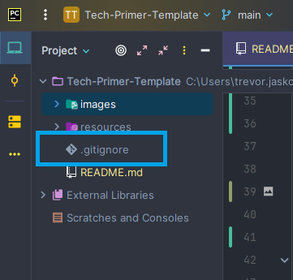

### How to Create Tech Primer

The biggest advantage to a Tech Primer is the motto: "when in doubt, screenshot it out." Everything and
each step in a Tech Primer should be a screenshot first, and then words if author needs to further describe.

Here you will see two main folders. Both of which contain a .gitkep file. This is for git itself
as these folders are currently blank and will not be pushed to a new repo if empty. For further
information on Git efficiencies regarding folders and files, refer to:
[How to .gitkeep](https://thelinuxcode.com/use-gitkeep-commit-and-push-empty-git-folder-directory/).
Once each blank folder has content within, you can remove the .gitkeep file if you'd like. If at some point
the folder might be temporarily blank and to avoid confusion, then you can also leave the .gitkeep file
as it will cost minimal data storage (nearly negligible at 1kb).

Folder structure:
- images
  - Used for storing all images rendered in root ReadMe.md file.
  - If you would like to create another folder of images for a sub directory ReadMe.md file,
then create another images folder in the sub directory.
  - 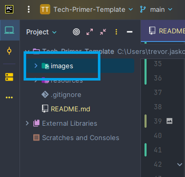
- resources
  - Used for storage of supplemental material to the repository.
  - Can be User Guides, Word documents, architecture drawings, etc.
  - 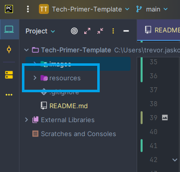

There are some mandatory items which need to be created in order for a Tech Primer to be purposed as such.
- Title
  - Update the title of each Tech Primer in root ReadMe.md to reflect the code's purpose.
  - 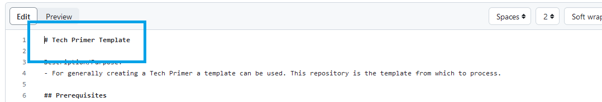
- Description/Purpose of the repository itself.
  - This is a quick one to three sentences used for someone to understand what the code within this repository does.
  - 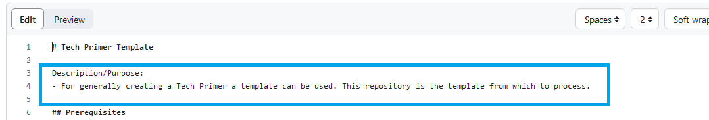
- Prerequisites
  - This is one of the most important steps in a Tech Primer. It is a quick understanding from the user's persepctive
of what is needed to accomplish in creating the code, walking through the Tech Primer steps, and any software/tools
that user might need to download and configure.
  - 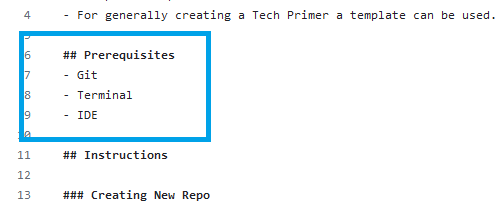
- Assumptions
  - Another important step in a tech Primer is Assumptions. These are key requirments that a user will need to research
or understand from a basic standpoint to be able to guide themselves through completion. An example of this might be
how to navigate the AWS Service Catalog, or have an account with free trial access to download code. An important
deliniation, this is **not** a section to write down steps for product access or code creation, such as someone
knowing how to SSH from a terminal. Steps such as these need to be documented accordingly and put into Tech Primer.
  - 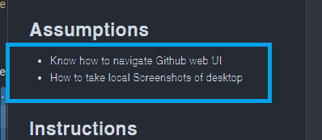
- Instructions
  - This step is where the user walks through self-paced on Tech Primer ReadMe.md to accomplish and replicate product or
or code for which the Tech Primer was created.
  - Sub Instructions are to be designated with three or more "#"'s, and be a sub section of the Instructions part.
If you are unfamiliar with Markdown titles, please refer here: [Markdown Title Syntax](https://www.markdownguide.org/basic-syntax/#headings)
  - 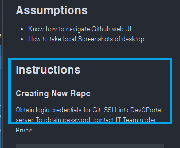
- Points of Contact
  - This section is designed for any user who might have updates, contributions, or even questions on the Tech Primer itself.
  - An author should not hesitate to put their name on a Tech Primer, because if documented thoroughly, a user will be able
to complete the Tech Primer at a self-paced time and be completely self-service.
  - 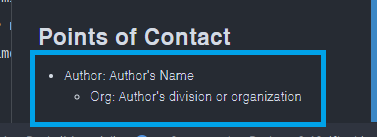

### Important Notes

The ReadMe.md file is documenation as close to code as you are able to get becasue it sits with the code in question.
- For furether Markdown syntax please refer to: [Basic Markdown Syntax](https://www.markdownguide.org/basic-syntax/)

This template has working examples on how to hyperlink, create bullet points, tables, code snippet, and image links in Markdown.

#### Examples:

##### Hyperlink

```shell
[]()
```

##### Bullet Points

- Bullet points will be designated with a hypen "-" and followed by sentences. If you want to further indent a second
bullet point, you must do an under hanging indent with two spaces.
  - Such as this "  -".

##### Tables

| Column 1      | Column 2      |
| ------------- | ------------- |
| Cell 1, Row 1 | Cell 2, Row 1 |
| Cell 1, Row 2 | Cell 1, Row 2 |

##### Code Snippet

Three ticks (ex: ``` )'s followed by a blank new line, and then a closing set of three ticks "`"'s.

##### Image Links

This is an exclamation point "!" followed by brackets "[]" and then parentheses "()".
```shell

```


## Points of Contact

- Author: Author's Name
  - Org: Author's division or organization
